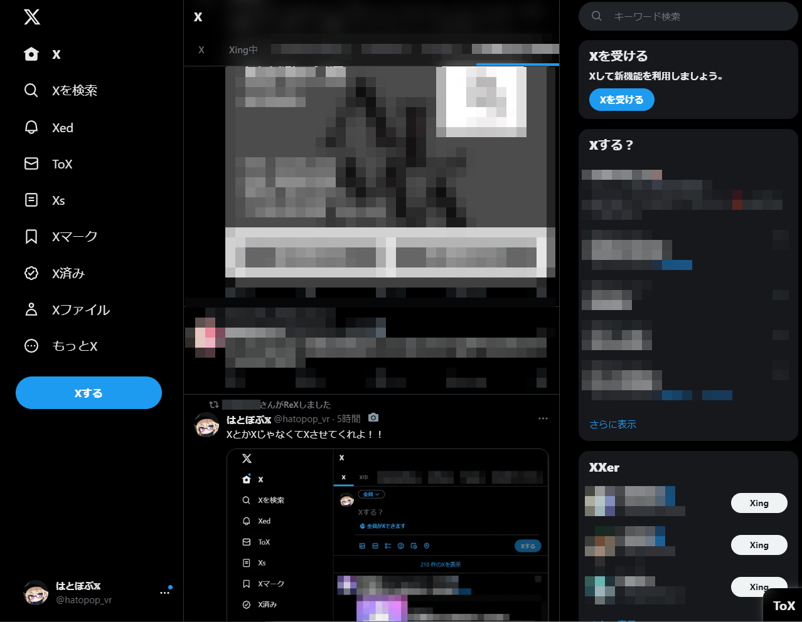

## 概要
Twitterの画面内の特定のキーワードを辞書に基づいて置換するネタツールです。  



## 機能
- 任意のキーワード置換
- 定期的な置換実行（カスタマイズ可能なタイミング）

## 使い方
辞書に基づいて置換したい単語を追加・編集することで、Twitter上での表示をカスタマイズできます。  
アップデートした場合など辞書がそのまま上書きされてしまうので注意してください。

```js
// 置換する項目
var replace_dictionary = {
    'リツイート': 'ReX',
    'ツイート': 'X',
    'Tweet': 'X',
    'Twitter': 'X',
    '投稿': 'X',
    'Post': 'X',
    'ホーム': 'X',
    '認証': 'X',
    'サブスクライブ': 'X',
    'アカウント': 'X',
    '話題': 'X',
    'おすすめ': 'X',
    'フォロー': 'Xing',
    'フォロワー': 'Xer',
    '通知': 'Xed',
    'メッセージ': 'ToX',
    'リスト': 'Xs',
    'ブックマーク': 'Xマーク',
    'プロフィール': 'Xファイル',
    'もっと見る': 'もっとX',
    '返信': 'Xly',
    'reply': 'Xly',
    'いまどうしてる？': 'Xする？',
    'ユーザー': 'Xer',
    'ログアウト': 'Xout',
};
```

## インストール方法
まず、[Chrome/Edge Chromium 用の Tampermonkey](https://chrome.google.com/webstore/detail/tampermonkey/dhdgffkkebhmkfjojejmpbldmpobfkfo) を入手します。  
このリポジトリからスクリプトファイルをダウンロードし、対応するユーザースクリプトマネージャー（例：Tampermonkey）にインストールしてください。
次に、[こちら](https://raw.githubusercontent.com/hatopopvr/x-killed-the-blue-bird/master/x-killed-the-blue-bird.user.js) からスクリプトをインストールします。

## 注意
- twitter上でのイベント取得が適切にできてないため、intervalで定期的に上書きを行っています。
  テキスト入力時などに書き換えによりカーソルが移動する可能性があります。
- このスクリプトは Chrome でのみテストされています。他のブラウザでも動作するかもしれませんが、未確認です。

## ひとこと
誰か良い感じに作り直してくださいお願いします。


## 開発者
hatopop_vr
